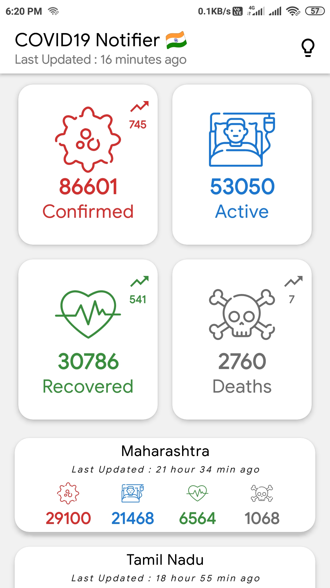
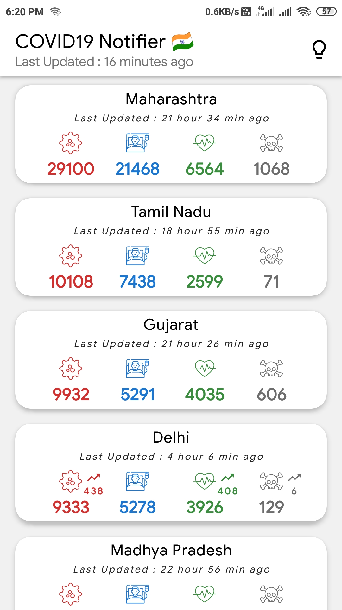
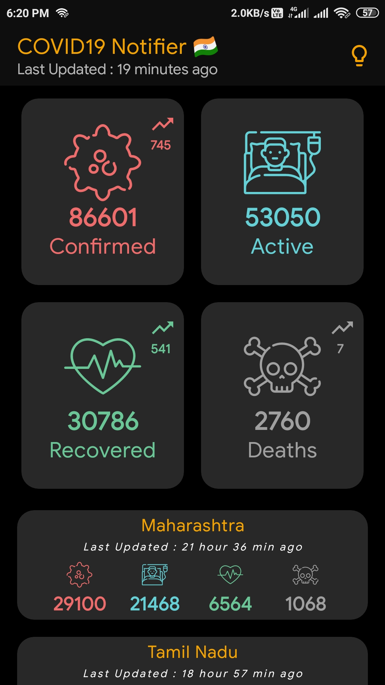
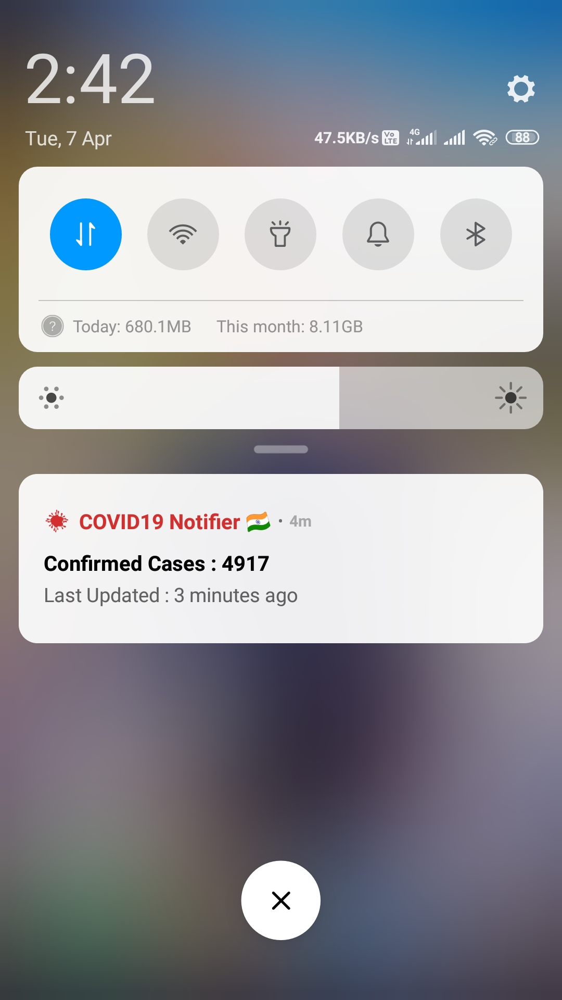

<p align="center">
  
</p>

# COVID19 Notifier - India 🇮🇳


[](LICENSE)


**Covid19 Notifier India** is a sample Android application 📱 built to demonstrate use of *Modern Android development* tools. Dedicated to all Android Developers with ❤️.

***You can Install and test latest Covid19 Notifier app from below 👇***

[](https://github.com/patilshreyas/covid19-notifier-in/releases/latest/download/app-debug.apk)

<table style="width:100%">
  <tr>
    <th>Main Screen (Total Report)</th>
    <th>Main Screen (State Report List)</th>
    <th>Main Screen (Dark Mode 🌗)</th>
    <th>Notification in the System Tray</th>
  </tr>
  <tr>
    <td></td>
    <td></td>
    <td></td>
    <td></td>
  </tr>
</table>

## About
- It simply loads **Total COVID19 cases in India** from [API](https://github.com/covid19india/api).
- It notifies total cases of COVID19 in India after every 1 hours.
- It shows the total cases of the District from every State.
- Dark mode too 🌗.
- It is offline capable (Using Cache) 😃.

*It uses `PeriodicWorkManager` which is scheduled at the first run of an app. After that, `Worker` will execute after every one hour of interval and will show notification on Android's system tray.*

## Built With 🛠
- [Kotlin](https://kotlinlang.org/) - First class and official programming language for Android development.
- [Coroutines](https://kotlinlang.org/docs/reference/coroutines-overview.html) - For asynchronous and more..
- [Flow](https://kotlin.github.io/kotlinx.coroutines/kotlinx-coroutines-core/kotlinx.coroutines.flow/-flow/) - A cold asynchronous data stream that sequentially emits values and completes normally or with an exception.
- [Android Architecture Components](https://developer.android.com/topic/libraries/architecture) - Collection of libraries that help you design robust, testable, and maintainable apps.
  - [LiveData](https://developer.android.com/topic/libraries/architecture/livedata) - Data objects that notify views when the underlying database changes.
  - [ViewModel](https://developer.android.com/topic/libraries/architecture/viewmodel) - Stores UI-related data that isn't destroyed on UI changes.
  - [ViewBinding](https://developer.android.com/topic/libraries/view-binding) - Generates a binding class for each XML layout file present in that module and allows you to more easily write code that interacts with views.
- [Koin](https://start.insert-koin.io/) - Dependency Injection Framework (Kotlin)
- [Retrofit](https://square.github.io/retrofit/) - A type-safe HTTP client for Android and Java.
- [Moshi](https://github.com/square/moshi) - A modern JSON library for Kotlin and Java.
- [Moshi Converter](https://github.com/square/retrofit/tree/master/retrofit-converters/moshi) - A Converter which uses Moshi for serialization to and from JSON.
- [WorkManager](https://developer.android.com/topic/libraries/architecture/workmanager) - The WorkManager API makes it easy to schedule deferrable, asynchronous tasks that are expected to run even if the app exits or device restarts.
- [Material Components for Android](https://github.com/material-components/material-components-android) - Modular and customizable Material Design UI components for Android

# Package Structure

    dev.shreyaspatil.covid19notify    # Root Package
    .
    ├── api                 # For API Service.
    ├── model               # Model classes
    ├── repository          # Repository to handle data from network using API.
    ├── di                  # Dependency Injection
    |
    ├── ui                  # Activity/View layer
    │   └── main            # Main Screen Activity, ViewModel and RecyclerView Adapters.
    |
    ├── utils               # Utility Classes / Kotlin extensions
    └── worker              # Worker class.


## Contribute
If you want to contribute to this project, you're always welcome!
See [Contributing Guidelines](CONTRIBUTING.md).

## Credits
Thanks to [COVID19India.org](https://github.com/covid19india/api) for open-source API.

## Contact
If you need any help, you can connect with me.

Visit:- [shreyaspatil.dev](https://shreyaspatil.dev)

## Contributed By:
- [Shreyas Patil](https://shreyaspatil.dev) (Maintainer)
- [Rohan Singh](https://twitter.com/zaraki596) (Contributor)

## License

```
MIT License

Copyright (c) 2020 Shreyas Patil

Permission is hereby granted, free of charge, to any person obtaining a copy
of this software and associated documentation files (the "Software"), to deal
in the Software without restriction, including without limitation the rights
to use, copy, modify, merge, publish, distribute, sublicense, and/or sell
copies of the Software, and to permit persons to whom the Software is
furnished to do so, subject to the following conditions:

The above copyright notice and this permission notice shall be included in all
copies or substantial portions of the Software.

THE SOFTWARE IS PROVIDED "AS IS", WITHOUT WARRANTY OF ANY KIND, EXPRESS OR
IMPLIED, INCLUDING BUT NOT LIMITED TO THE WARRANTIES OF MERCHANTABILITY,
FITNESS FOR A PARTICULAR PURPOSE AND NONINFRINGEMENT. IN NO EVENT SHALL THE
AUTHORS OR COPYRIGHT HOLDERS BE LIABLE FOR ANY CLAIM, DAMAGES OR OTHER
LIABILITY, WHETHER IN AN ACTION OF CONTRACT, TORT OR OTHERWISE, ARISING FROM,
OUT OF OR IN CONNECTION WITH THE SOFTWARE OR THE USE OR OTHER DEALINGS IN THE
SOFTWARE.
```
